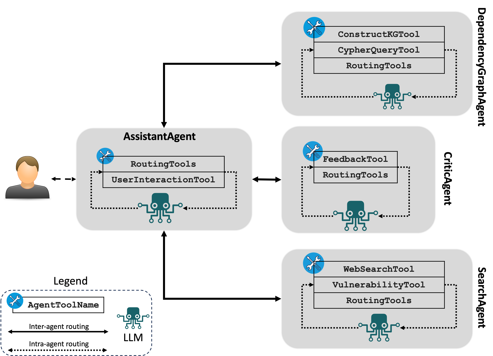
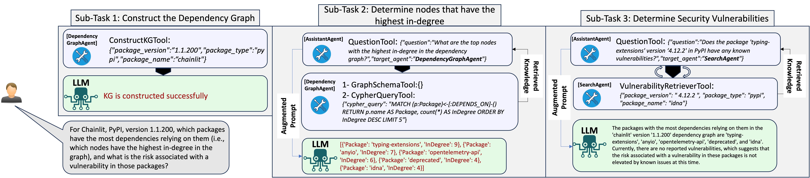

<div align="center">
  
</div>
<br><br>


# DepsRAG

`DepsRAG` is a chatbot that answers user's questions about software dependencies after representing them as a Knowledge Graph (KG). `DepsRAG` offers the following features:
- Constructing the software dependencies (direct and transitive) as a KG.
- Supporting 4 popular software ecosystems (i.e. PyPI, NPM, Cargo, and Go). 
- Generatiing atutomatically Cypher queries to retrieve information from the KG.
- Augmenting users' questions with the retrieved information from the KG, as well as from the Web and Vulnerability DB.

## DepsRAG Architecture

DepsRAG comprises the following agents to accomplish its process:

1. **AssistantAgent.** This agent orchestrates the work between the agents. It also breaks down complex questions into simple steps and then aggregates all responses to answer the user's query. This agent utilizes the following tool:
   - `UserInteractionTool`: manages the interaction between the chatbot and user. 
2. **DependencyGraphAgent.** This agent handles the interactions the with graph database that represents the dependencies.
   - `ConstructKGTool`: builds the dependency graph for a given pkg version, using the API
   at [DepsDev](https://deps.dev/).
   - `GraphSchemaTool`: gets schema of Neo4j knowledge-graph.
   - `CypherQueryTool`: generates cypher queries to get information from
   Neo4j knowledge-graph (Cypher is the query language for Neo4j).
   - `VisualizeGraph`: visualizes the entire dependency grpah. 
3. **CriticAgent.** This agent provides a feedback upon the final answer provided by the **AssistantAgent**.
   - `FeedbackTool`: provides the feedback message. 
4. **SearchAgent.**
   - `WebSearchTool`: to find package version and type information. It also can answer other question from the web about other aspects after obtaining the intended information from the dependency graph For examples:
      - does the dpendency use latest version for this package verion?
      - can I upgrade this package in the dependency graph?
    - `VulnerabilityTool`: searches OSV vulnerability DB based on package name, version, and its ecosystem.


## DepsRAG Workflow

The workflow of `DepsRAG` as follows: 
- The **AssistantAgent** asks you to provide the package name, version, and ecosystem of the intended software package.
- The **AssistantAgent** forwards these details to the **DependencyGraphAgent** for constructing the dependencies (direct and transitive) as knowledge graph.
- The **AssistantAgent** asks you to ask questions about the dependencies.
- The **AssistantAgent** decomposes complex questions into simple steps and then leverages the RAG mechanism to retreieve additional information from the Web, knowledge graph, and/or vulnerability database to augment the user's question with the additional information.

For package X, version, Y, in ecosystem Z, following are examples of questions:
   - what's the depth of the graph?
   - what are the direct dependencies?
   - any dependency on pytorch? which version?
   - Is this package pytorch vunlnerable?
   - tell me 3 interesting things about this package or dependency graph
   - what's the path between package-1 and package-2? (provide names of package-1 and -2)
   - Tell me the names of all packages in the dependency graph that use pytorch.

The following illustration shows the steps that `DepsRAG` will take to answer this question:

> For Chainlit, PyPI, version 1.1.200, which packages have the most dependencies relying on them (i.e., which nodes have the highest in-degree in the graph), and what is the risk associated with a vulnerability in those packages?


<div align="center">
  
</div>
<br><br>


# :fire: Updates/Releases

<details>
<summary> <b>Click to expand</b></summary>

- **Sept 2024:** 
  - Adding critic-agent interaction.

- **Aug 2024:** 
  - Adding DuckDuck web search tool.

- **July 2024:** 
  - Creating containerized version of DepsRAG that support UI and CLI mode.

- **May 2024:** 
  - Adding integration with [OSV](https://osv.dev/) vulnerability database to search for 
  vulnerabilities

- **April 2024:**
   - Supporting the construction of dependency graph for Go, Cargo, and NPM.

- **March 2024:**
   - Supporting Chainlit to run DepsRAG via UI

- **Feb 2024:**
   - Adding tool to visualize the dependency graph

</details>


# :gear: Installation and Setup
DepsRAG requires Python 3.11+. We recommend using a virtual environment.

```bash
# clone the repo and cd into repo root
git clone https://github.com/Mohannadcse/DepsRAG.git
cd DepsRAG

# create a virtual env under project root, .venv directory
python3 -m venv .venv

# activate the virtual env
. .venv/bin/activate

# install dependencies from pyproject.toml:
# This installs DepsRAG
poetry install 
```

## Set up environment variables (API keys, etc)

`DepsRAG` requires a set of environment variables to operate. In the root of the repo, copy the [`.env-template`](.env-template) file to a new file `.env` to set the values of these environment variables.

```
cp .env-template .env
```

Following is a description of these environment variables:

- **LLM Settings:** by default `DepsRAG` support OpenAI model `gpt-4o`. Therefore, `DepsRAG` requires `OPENAI_API_KEY=your-key-here-without-quotes`. However, `DepsRAG` supports other models that are enabled by `Langroid` like [Azure](https://github.com/langroid/langroid?tab=readme-ov-file#set-up-environment-variables-api-keys-etc), [Open/Local LLMs](https://langroid.github.io/langroid/tutorials/local-llm-setup/), and other [non-OpenAI](https://langroid.github.io/langroid/tutorials/non-openai-llms/) proprietary LLMs. Therefore, you need to provide the corresponding environment settings for the required LLM. For example, Azure settings required are listed inside [`.env-template`](.env-template) and start with `AZURE_`.

- **Google Custom Search API Credentials:** Only needed to enable an Agent to use the `GoogleSearchTool`.
  To use Google Search as an LLM Tool//function-call, 
  you'll need to set up 
  [a Google API key](https://developers.google.com/custom-search/v1/introduction#identify_your_application_to_google_with_api_key),
  then [setup a Google Custom Search Engine (CSE) and get the CSE ID](https://developers.google.com/custom-search/docs/tutorial/creatingcse).
  (Documentation for these can be challenging, we suggest asking GPT4 for a step-by-step guide.)
  After obtaining these credentials, store them as values of 
  `GOOGLE_API_KEY` and `GOOGLE_CSE_ID` in your `.env` file. 

- **Neo4j:** The easiest way to get access to neo4j is
by creating a cloud account at [Neo4j Aura](https://neo4j.com/cloud/platform/aura-graph-database/). OR you
can use Neo4j Docker image using this command:

```bash
docker run --rm \
    --name neo4j \
    -p 7474:7474 -p 7687:7687 \
    -e NEO4J_AUTH=neo4j/password \
    neo4j:latest
```

Upon creating the cloud account successfully, neo4j will create a text file contains
account settings. Please provide the following Neo4j environment variables: 

```
NEO4J_USERNAME=typically neo4j
NEO4J_PASSWORD=your-neo4j-password
NEO4J_URI=uri-to-access-neo4j-dayabase OR bolt://neo4j:7687 if you use Neo4j Docker image
NEO4J_DATABASE=typically neo4j
```

## :whale: Docker Instructions

We provide a containerized version of `DepsRAG`, where you can run `DepsRAG` using
 `Chainlit` in UI mode or CLI mode.  
All you need to do is set up environment variables in the `.env`
 (as shown in [`.env-template`](.env-template)) file after clonning `DepsRAG` repository.
We created ths script [`run_depsrag_docker.sh`](run_depsrag_docker.sh). So everything
 will be working in an automated manner. Once you run this script, it will ask you to
 select the mode for running `DepsRAG`. Then you can interact with `DepsRAG` chatbot. 

```bash
git clone https://github.com/Mohannadcse/DepsRAG.
cd DepsRAG
docker compose build
chmod +x run_depsrag_docker.sh
./run_depsrag_docker.sh
```
The script `run_depsrag_docker.sh` spins up two containers: Neo4j and `DepsRAG` app.
After finishing the interaction with `DepsRAG` chatbot, you can run the command
 `docker compose down` to shut down the containers.

# Running DepsRAG

`DepsRAG` supports two modes: CLI and UI (using `chainlit`).

Run `DepsRAG` in the CLI mode using this command:
```
python3 dependencyrag/depsrag_multiagent.py
 -m <LLM-Name>
```

The flag `-m` provides the option to overwrite the default LLM (`gpt-4o`) used by `DepsRAG`. If you want to use Azure, set the flag `-m azure`, while for other LLMs, please check Langroid documentation ([Open/Local LLMs](https://langroid.github.io/langroid/tutorials/local-llm-setup/) and other [non-OpenAI](https://langroid.github.io/langroid/tutorials/non-openai-llms/) proprietary LLMs).

Here is a recording shows the CLI mode in action:


Run `DepsRAG` in the UI mode using this command:
```
chainlit run dependencyrag/chainlit/chainlit_dependency_chatbot.py
```

**NOTE:** the dependency graph is constructed based
on [DepsDev API](https://deps.dev/). Therefore, the Chatbot will not be able to
construct the dependency graph if this API doesn't provide dependency metadata
infromation.


# DepsRAG Paper Citation

You can find the paper that describes the details of DepsRAG [HERE](https://arxiv.org/abs/2405.20455)

```
@misc{alhanahnah2024depsrag,
      title={DepsRAG: Towards Managing Software Dependencies using Large Language Models}, 
      author={Mohannad Alhanahnah and Yazan Boshmaf and Benoit Baudry},
      year={2024},
      eprint={2405.20455},
      archivePrefix={arXiv},
      primaryClass={cs.SE}
}
```

