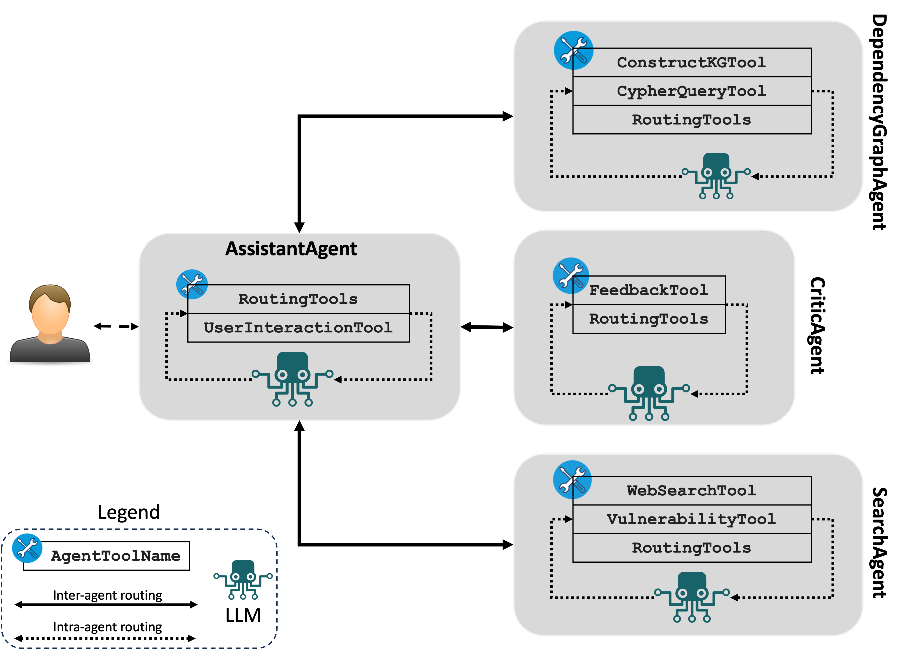

# DepsRAG (Agno Version)

<div align="center">
  
</div>
<br><br>

## Overview

`DepsRAG` is an AI-powered chatbot that answers questions about software dependencies by representing them as a Knowledge Graph (KG) using Neo4j. It uses a multi-agent system powered by Agno to provide comprehensive, validated answers.

### Key Features

- 🗂️ **Dependency Graph Construction**: Build complete dependency trees (direct & transitive) as Neo4j knowledge graphs
- 🌐 **Multi-Ecosystem Support**: PyPI, NPM, Cargo, and Go packages
- 🔗 **Cross-Dependency Graph Assembly**: Recursively collect dependency data across ecosystems, enrich root package nodes with artifact/native-module metadata across supported ecosystems, then upload the assembled graph to Neo4j in one write operation
- 🤖 **Multi-Agent System**: Specialized agents for different tasks
- 🔍 **Automatic Query Generation**: Natural language to Cypher query translation
- 🔒 **Security Analysis**: Integration with OSV vulnerability database
- 🌍 **Web Search Integration**: DuckDuckGo search for additional information
- ✅ **Answer Validation**: Critic agent for quality assurance

## Architecture

DepsRAG uses a **multi-agent system** with the following specialized agents:

### 1. **Team Coordinator** (Agno Team)
- Orchestrates the end-to-end workflow
- Delegates package/graph tasks to DependencyGraphAgent
- Delegates web/security tasks to SearchAgent
- Synthesizes member outputs into one response
- Delegates to CriticAgent for validation before final delivery

### 2. **DependencyGraphAgent**
- Builds dependency graphs using the deps.dev API
- Assembles the full dependency graph in memory first, including cross-ecosystem dependencies
- Enriches root graph nodes with artifact/native-module metadata (PyPI, NPM, Cargo, and Go)
- Uploads nodes and relationships to Neo4j in one atomic write query
- Translates natural language to Cypher queries
- Executes queries on the Neo4j knowledge graph
- Provides graph visualization capabilities

**Tools:**
- `construct_dependency_graph`: Build the KG for a package
- `execute_cypher_query`: Query the Neo4j database
- `get_graph_schema`: Get database structure info
- `visualize_dependency_graph`: Create HTML visualizations

### 3. **SearchAgent**
- Performs web searches using DuckDuckGo
- Checks security vulnerabilities using OSV database
- Provides package information and documentation links

**Tools:**
- `web_search`: Search the web for information
- `check_vulnerability`: Query OSV vulnerability database

### 4. **CriticAgent**
- Validates responses synthesized by the Team coordinator
- Provides feedback on reasoning and completeness
- Ensures high-quality, accurate answers

## Workflow

```
1. User provides package info (name, version, ecosystem)
   ↓
2. Team Coordinator → DependencyGraphAgent: Build dependency graph
  - Recursively collect dependencies from deps.dev (including cross-ecosystem links)
  - Enhance root package metadata (for example, native modules across supported ecosystems)
  - Upload assembled graph to Neo4j in one write operation
   ↓
3. User asks questions about dependencies
   ↓
4. Team Coordinator breaks down complex questions
   ↓
5. Team Coordinator delegates:
   - DependencyGraphAgent: Graph queries
   - SearchAgent: Web search / vulnerability checks
   ↓
6. Team Coordinator aggregates member outputs
   ↓
7. CriticAgent validates and provides feedback
   ↓
8. Final answer returned to user
```

## Installation

### Requirements

- **Python**: 3.11 or higher
- **Neo4j**: Cloud account or local instance
- **LLM Provider** (choose one):
  - **OpenAI** API Key
  - **Azure OpenAI** credentials
  - **Google Gemini** API Key

### Setup

1. **Clone the repository:**
```bash
git clone https://github.com/Mohannadcse/DepsRAG.git
cd DepsRAG
```

2. **Install dependencies:**
```bash
# Using poetry (recommended)
poetry install

# Or using pip
pip install -e .
```

3. **Set up Neo4j (choose one):**

  **Option A: Neo4j Aura (cloud)**
  - Create a free account at [neo4j.com](https://neo4j.com/cloud/platform/aura-graph-database/)
  - Note your URI, username, and password

  **Option B: Local Neo4j with Docker**
  - Start a local Neo4j instance:

```bash
docker run -d \
  --name depsrag-neo4j \
  -p 7474:7474 -p 7687:7687 \
  -e NEO4J_AUTH=neo4j/password \
  -e NEO4J_PLUGINS='["apoc"]' \
  -e NEO4J_dbms_security_procedures_unrestricted=apoc.* \
  -v neo4j_data:/data \
  neo4j:5
```

  - Open the Neo4j Browser at http://localhost:7474
  - Use the following credentials:
    - URI: bolt://localhost:7687
    - Username: neo4j
    - Password: password

4. **Configure environment variables:**
```bash
cp .env-template .env
# Edit .env with your credentials
```

Required environment variables:
```bash
# Option 1: OpenAI
OPENAI_API_KEY=your_openai_api_key

# Option 2: Azure OpenAI
AZURE_OPENAI_API_KEY=your_azure_key
AZURE_OPENAI_ENDPOINT=https://your-endpoint.openai.azure.com/
AZURE_OPENAI_DEPLOYMENT=gpt-4o

# Option 3: Google Gemini
GOOGLE_API_KEY=your_google_api_key
GOOGLE_MODEL_ID=gemini-2.0-flash  # Optional, defaults to gemini-2.0-flash-exp

# Neo4j (required for all options)
NEO4J_URI=neo4j+s://your-instance.databases.neo4j.io
NEO4J_USERNAME=neo4j
NEO4J_PASSWORD=your_password
NEO4J_DATABASE=neo4j
```

**Note:** If `--provider` is not specified, the system auto-detects in this order:
1. Azure OpenAI (if `AZURE_OPENAI_API_KEY` is set)
2. Google Gemini (if `GOOGLE_API_KEY` is set)
3. OpenAI (default fallback)

5. **Install optional dependencies:**
```bash
# For web search functionality
pip install duckduckgo-search
```

## Usage

### Command Line Interface

**Basic usage (auto-detects provider from environment):**
```bash
python dependencyrag/main.py
```

**With specific provider:**
```bash
# Using Google Gemini
python dependencyrag/main.py --provider google --model gemini-2.0-flash

# Using Azure OpenAI
python dependencyrag/main.py --provider azure --model gpt-4o

# Using OpenAI
python dependencyrag/main.py --provider openai --model gpt-4o
```

**Available options:**
- `--provider`: LLM provider (`openai`, `azure`, `google`). Auto-detects if not specified
- `--model`: Model ID to use (default: gpt-4o)
- `--db-file`: SQLite database file (default: depsrag.db)
- `--debug`: Enable debug mode
- `--no-stream`: Disable streaming responses

### Example Session

```
You: Please analyze chainlit version 1.1.200 from PyPI

DepsRAG (Team Coordinator): I'll help you analyze chainlit 1.1.200. Let me start by 
constructing the dependency graph...

[DependencyGraphAgent constructs the graph]

DepsRAG (Team Coordinator): The dependency graph has been created! What would you like 
to know about the dependencies?

You: What are the direct dependencies?

DepsRAG (Team Coordinator): Let me query the graph for direct dependencies...

[Returns list of direct dependencies]

You: Are there any known vulnerabilities in this version?

DepsRAG (Team Coordinator): Let me check the OSV vulnerability database...

[SearchAgent checks for vulnerabilities]

DepsRAG (Team Coordinator): I found the following security information...
```

### Programmatic Usage

```python
from dependencyrag import create_depsrag_team

# Create the team (auto-detects provider from environment)
team = create_depsrag_team(
    model_id="gpt-4o",
    db_file="my_analysis.db"
)

# Or specify a provider explicitly
team = create_depsrag_team(
    model_id="gemini-2.0-flash",
    provider="google",  # "openai", "azure", or "google"
    db_file="my_analysis.db"
)

# Run a query
response = team.run(
    "Analyze the dependencies for requests version 2.31.0 from PyPI"
)

print(response.content)

# Ask follow-up questions
response2 = team.run("What are the direct dependencies?")
print(response2.content)
```

## Example Questions

After constructing a dependency graph, you can ask:

- **Graph structure:**
  - "What's the depth of the dependency graph?"
  - "How many total packages are in the graph?"
  - "What are the direct dependencies?"

- **Specific packages:**
  - "Is there a dependency on pytorch? Which version?"
  - "What's the path between package-1 and package-2?"
  - "Which packages depend on numpy?"

- **Analysis:**
  - "Which packages have the most dependencies relying on them?"
  - "Tell me 3 interesting things about this dependency graph"
  - "What are the leaf nodes in the graph?"

- **Security:**
  - "Are there any known vulnerabilities in this package?"
  - "Check all dependencies for security issues"

- **General info:**
  - "What's the latest version of this package?"
  - "Can I upgrade any dependencies?"

## Testing

Run the test suite:

```bash
# Run Neo4j tools integration tests
python tests/test_neo4j_tools.py

# Run integration tests
python tests/test_integration.py

# Or use pytest
pytest tests/ -v
```

Current integration coverage in `tests/test_neo4j_tools.py` includes:
- Successful/failed graph construction checks
- Case-sensitivity and query execution checks
- Cross-language enrichment check (`Package -> Native` edges)
- Multi-ecosystem graph construction checks (NPM, Cargo, Go)
- Cargo native persistence check after fresh root rebuild

Run the example script:

```bash
python examples/basic_example.py

# Cross-ecosystem smoke check (graph + native nodes)
python examples/ecosystem_smoke_check.py
```

## Project Structure

```
DepsRAG/
├── dependencyrag/
│   ├── __init__.py              # Package initialization
│   ├── main.py                  # CLI entry point
│   ├── agno_agents.py           # Agent definitions
│   ├── agno_tools.py            # Tool definitions
│   ├── depsrag_team.py          # Team orchestration
│   ├── neo4j_tools.py           # Neo4j utilities
│   └── cypher_message.py        # Cypher query templates
├── tests/
│   ├── test_neo4j_tools.py      # Neo4j tools integration tests
│   ├── test_integration.py      # Integration tests
│   └── README.md                # Test documentation
├── examples/
│   └── basic_example.py         # Usage example
│   └── ecosystem_smoke_check.py # Cross-ecosystem smoke validation
├── docs/                        # Documentation assets
├── .env-template                # Environment template
├── pyproject.toml               # Dependencies
└── README.md                    # This file
```

## Troubleshooting

### Neo4j Connection Issues
- Verify your Neo4j credentials in `.env`
- Check that your Neo4j instance is running
- Ensure you're using the correct URI format

### API Key Issues
- Verify your API key is valid for your chosen provider (OpenAI, Azure, or Google)
- Check that you have sufficient API credits/quota
- Ensure the key is properly set in `.env`
- For Azure: verify endpoint URL and deployment name are correct
- For Google: check that you haven't exceeded free tier limits

### Package Installation Issues
- Use Python 3.11 or higher
- Install with `pip install -e .` for development mode
- Try `poetry install` if pip fails

### Ecosystem Availability Notes
- DepsRAG supports graph and native analysis for PyPI, NPM, Cargo, and Go.
- End-to-end Go graph construction depends on deps.dev returning metadata for the selected module/version.
- If deps.dev returns 404 for Go, use a different module/version candidate or run artifact-only native checks.

## Contributing

Contributions are welcome! Please:

1. Fork the repository
2. Create a feature branch
3. Make your changes
4. Add tests if applicable
5. Submit a pull request

## License

MIT License - see LICENSE file for details

## Citation

If you use DepsRAG in your research, please cite:

```bibtex
@software{depsrag2024,
  title={DepsRAG: Dependency Analysis with RAG and Multi-Agent Systems},
  author={Mohannad Alhanahnah},
  year={2024},
  url={https://github.com/Mohannadcse/DepsRAG}
}
```

## Acknowledgments

- Original DepsRAG implementation using Langroid
- [Agno](https://github.com/agno-agi/agno) multi-agent framework
- [deps.dev](https://deps.dev/) API for dependency data
- [OSV](https://osv.dev/) vulnerability database
- Neo4j graph database

## Contact

- **Author**: Mohannad Alhanahnah
- **Email**: mohannad.alhanahnah@gmail.com
- **GitHub**: [@Mohannadcse](https://github.com/Mohannadcse)

